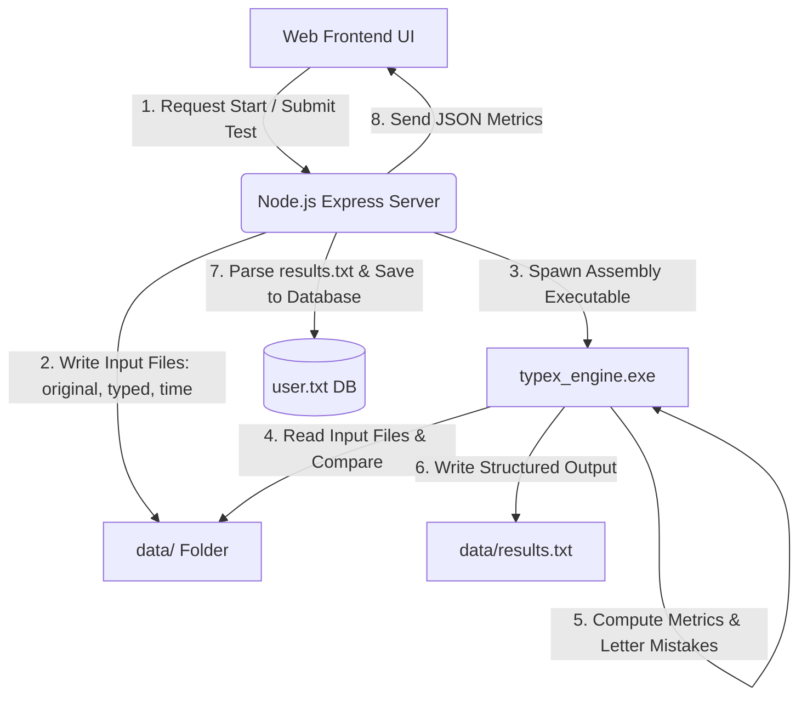

# ⚡ TypeX Pro - Advanced Hybrid Typing Test Platform

**TypeX Pro** is a premium, high-performance hybrid typing speed analysis platform. The application combines a low-level **x86 Assembly compilation engine** (for high-speed mathematical comparison and metrics calculation) with a modern **Node.js/Express backend** and a visual **Web UI frontend**.

---

## 🚀 Key Features

*   **Multilingual Typing Tests:** Practice in multiple languages including **English**, **Spanish**, **French**, and **German**.
*   **Dynamic Difficulty Scaling:** Choose between **Easy**, **Medium**, and **Hard** levels tailored with custom paragraph pools.
*   **Custom Text Support:** Paste your own custom paragraphs (up to 1,000 characters) for targeted practice.
*   **User Accounts & Authentication:** Secure Signup/Login system with password hashing (SHA-256) and persistent database storage.
*   **Historical Performance Analytics:** Track your WPM (Words Per Minute), Accuracy, and Scores over time, with the ability to delete past runs.
*   **Advanced Assembly-Powered Engine Metrics:**
    *   **WPM (Words Per Minute)** calculation.
    *   **Accuracy (%)** matching indices.
    *   **Wrong vs. Correct** character counting.
    *   **Letter-Specific Mistake Tracking:** Tracks exactly which characters (A-Z) you missed most frequently.
    *   **Typing Ranks:** Automatically awards **Beginner**, **Pro**, or **Elite** ranks based on speed.

---

## 🛠️ System Architecture & Workflow

The platform leverages a **hybrid architecture** that bridges high-level web tech with native low-level assembly execution:



1.  **Frontend:** The user interacts with a responsive web interface to start a test or submit typed text.
2.  **Backend:** The Express server writes text files (`input_original.txt`, `input_typed.txt`, `input_time.txt`) representing transient test states to disk.
3.  **Assembly Engine:** The server spawns the compiled native assembly executable (`typex_engine.exe`).
4.  **Parsing & Output:** The assembly engine reads the state files, executes native comparison loops (checking correct characters, wrong characters, and frequency of specific character mistakes), calculates metrics, and outputs structured labels in `results.txt`.
5.  **Data Persistence:** The backend parses the results text file, writes record history to `user.txt`, and sends the final JSON response to the user's browser.

---

## 📁 Repository Structure

```
typex_pro/
│
├── assembly/
│   ├── typex_engine.asm       # Core x86 Assembly engine source code (Irvine32)
│   ├── make.bat               # Windows batch script to compile assembly file
│   └── typex_engine.exe       # Compiled assembly executable
│
├── backend/
│   ├── data/                  # Dynamic database & paragraphs store
│   │   ├── paragraphs/        # Multilingual default paragraphs text files
│   │   └── user.txt           # Flat file JSON database containing user credentials & history
│   ├── server.js              # Express Node.js backend server
│   ├── package.json           # Backend project metadata & dependencies
│   └── typex_engine.exe       # Copy of assembly executable executed by Node server
│
├── frontend/
│   ├── index.html             # Typing test user interface
│   ├── script.js              # Front-end interactivity and API hooks
│   └── style.css              # Custom visual system & styling
│
└── .gitignore                 # Excludes node_modules and OS-specific files
```

---

## ⚙️ Setup & Installation Instructions

### Prerequisites
*   **Node.js** (v14 or above recommended)
*   **Git**
*   **Windows Operating System** (since Irvine32 and compiled executables are PE binaries configured for Windows)
*   *Optional:* MASM (Microsoft Macro Assembler) and Irvine32 Library to recompile the assembly code.

---

### Step 1: Clone & Configure Workspace
Open your terminal and clone the repository:
```bash
git clone https://github.com/Azkaabbasi14/TypeXPro.git
cd TypeXPro
```

### Step 2: Install Node.js Dependencies
Navigate to the `backend/` directory and install Express, CORS, and other package requirements:
```bash
cd backend
npm install
```

### Step 3: Compile Assembly Code (Optional)
If you modify the source assembly code in `assembly/typex_engine.asm`, you can compile it using MASM and Irvine32:
1. Make sure the Irvine32 directory path is configured on your system.
2. Double-click or run the build command inside the `assembly` folder:
   ```cmd
   cd assembly
   make.bat
   ```
3. Copy the compiled `typex_engine.exe` file into the `backend/` directory.

### Step 4: Run Server
Start the local server inside the `backend` folder:
```bash
npm start
```
The server will boot on [http://localhost:3000](http://localhost:3000).

### Step 5: Test Platform
Open [http://localhost:3000](http://localhost:3000) in your web browser and start typing!

---

## 📜 Assembly Code Modules (Core Procedures)

For study, the assembly engine exposes the following main code procedures:

*   **`TrackMistake`:** Logs frequency of specific keystroke mistakes in a letter index array (A-Z).
*   **`StringToInteger` (atoi):** Converts null-terminated ASCII decimal inputs (like seconds typed) to 32-bit registers.
*   **`WriteDecToBuffer` (itoa):** Renders computed statistics from registers back to structured output text buffers (using Stack/LIFO operations).
*   **`StrContains`:** Case-insensitive search algorithm for parsing command line arguments.
*   **`CalculateResults`:** Main processing procedure orchestrating data reading, parsing, arithmetic computation, and file outputs.